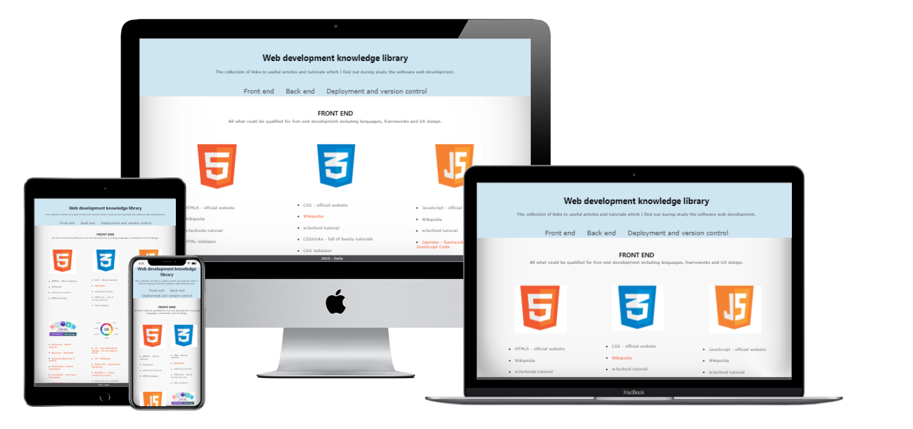
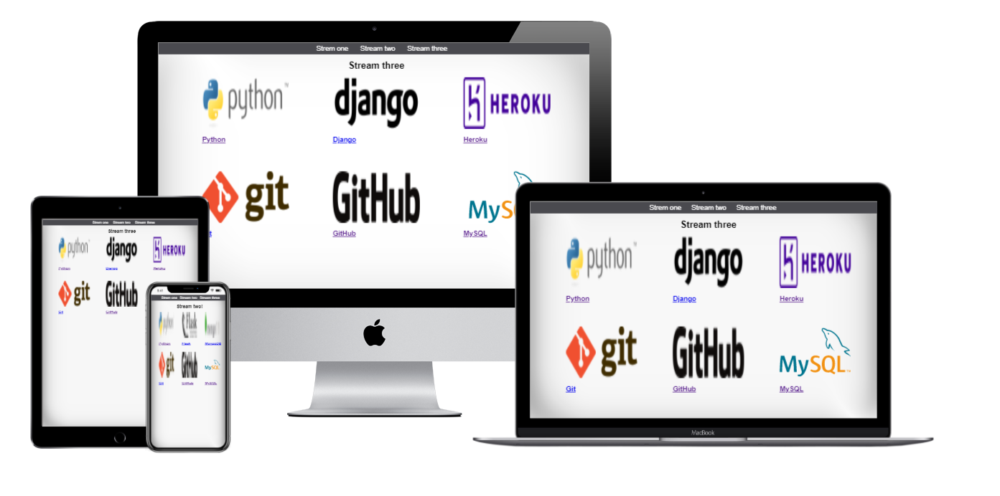

# 2021 My first webpage - refactored

This is my first website done during studying the software web development in Code Institute.
Since i don't like wasting anything
and also i do not like to have unusefull projects on my github 
I decided to make this usefuly.

To do that i rebuild a bit my very first page and create the "Software Web Development knowdledge library"

## What project is?

Project is a simple website split by 3 webpages written only in HTML and CSS. 
It is a collection of links to good tutorials and official documentation of programming languages for frontend and backend development, but also for version control and deployment.

## What is about it?

This website is about making old projects new, not wasting the space in the network, but mostly
it is about learning software web development.
Main idea is to have all good knowledge in one place - at least links to the pages with knowledge - I am not going to rewrite django documentation ;)

## What did i learn new when refactor this website?

I learn how to have done quick mockups from url - i place link in front end page under ux design.
I learn that there is a lot of tools to generate color scheme.
I also learn that is hard to not use the knowledge when refactor the website. It is hard actually to leave web as it was done on the first place, but i tried and only one think which i use and which i didn't know when i did this page first time was the responsivness and media selector in css.

## What is my impressions during making this?

Some colours, different size of images and page can look better.

## Others

I leave below the first version of readme and mockups of the look of this website from 2019 to remember from where this is coming and how this all start.
# 2019 My first webpage

This is the very first website done during studying the software web development in Code Institute.

## What project is?

It is a simple web page with 3 pages, menu, images and links. 

## What is about it?

The content of page are links to the main platform/languages which i will going to learn during my study.

## What did i learn and use in this website?

I learn the html structure and basic CSS.
I use the nav attribute to create a links.
I did learn how to use CSS to make simple, but nice menu.
I learn how to use CSS to put pictures in 3 columns. It is look like small library
with pictures of languages/services logos, which are the links to the wikipedia description
of them.

## What is my impressions during making this?

I was really enjoying during make this website. I learn small thinks,
which can make website look nice. I never thought that it is so easy to make simple webpage.
The big and usefull part during those lessons were about git. I know how to stage, commit and push changes to the repository locally, but also remote one.
Lessons gives an good induction to the version control
In the end i have learn how to deploy the site using github pages.

